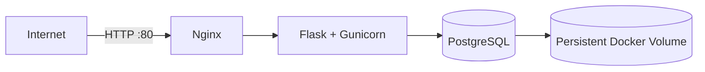
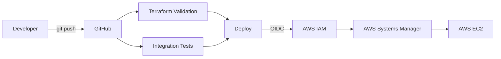

# AWS Docker Web Application

I built this project to practice a complete DevOps workflow, starting from a local Docker environment and ending with an automated deployment to AWS.

The application runs as a Docker Compose stack with Nginx, Flask/Gunicorn, and PostgreSQL. GitHub Actions handles validation, integration testing, and deployment. AWS OIDC is used instead of long-lived credentials, AWS Systems Manager handles remote deployment, and Terraform manages the AWS infrastructure.

## Application Architecture



Only Nginx is exposed publicly.

The application container and PostgreSQL stay inside Docker's internal network.

## CI/CD Architecture



A deployment only runs after both the Terraform validation and application integration tests succeed.

## What I Worked On

During this project I:

- containerized the Flask application with Docker
- used Gunicorn instead of the Flask development server
- configured Nginx as a reverse proxy
- created a multi-service Docker Compose environment
- added PostgreSQL with persistent storage
- added application and database health checks
- deployed the stack to AWS EC2
- configured AWS Systems Manager for remote deployments
- configured GitHub Actions for automated testing and deployment
- used GitHub OIDC to authenticate to AWS without permanent access keys
- imported manually created AWS infrastructure into Terraform
- brought the Terraform configuration to zero infrastructure drift
- added Terraform validation to the CI pipeline

## Problems I Solved

A big part of this project was troubleshooting the environment while building it.

Some of the issues I worked through included:

- fixing container startup failures caused by a missing Gunicorn dependency
- troubleshooting Docker Desktop and WSL integration on Windows
- configuring Docker health checks for the application and database
- verifying PostgreSQL persistence after container recreation
- securing PostgreSQL so port `5432` is not exposed publicly
- configuring AWS IAM permissions for Systems Manager
- configuring GitHub OIDC trust between GitHub Actions and AWS
- fixing deployment permissions and EC2 instance targeting in the CI/CD pipeline
- importing existing AWS resources into Terraform without recreating the EC2 instance
- handling EC2 public IP changes after stop/start without breaking deployment

The deployment pipeline uses the EC2 instance ID and AWS Systems Manager, so it does not depend on the instance's changing public IP.

## Tech Stack

| Area | Technologies |
|---|---|
| Cloud | AWS EC2, IAM, Systems Manager |
| Infrastructure as Code | Terraform |
| CI/CD | GitHub Actions, GitHub OIDC |
| Containers | Docker, Docker Compose |
| Reverse Proxy | Nginx |
| Application | Flask, Gunicorn |
| Database | PostgreSQL |
| OS | Ubuntu Linux |

## Docker Services

The application runs as three Docker Compose services.

### `nginx`

Public entry point for the application.

It listens on port `80` and forwards traffic to Gunicorn through Docker's internal network.

### `app`

Flask application served by Gunicorn on port `5000`.

Port `5000` is not published to the Internet.

### `db`

PostgreSQL database on port `5432`.

The database port is not exposed publicly.

A named Docker volume stores the PostgreSQL data.

## Health Checks

The project includes the following endpoints:

| Endpoint | Purpose |
|---|---|
| `/health` | Application health |
| `/db-health` | PostgreSQL connectivity |
| `/visits` | Database read/write and persistence test |

Both the application and PostgreSQL containers also use Docker health checks.

## PostgreSQL Persistence

I verified persistence by:

1. writing records through `/visits`
2. stopping and recreating the containers
3. starting the stack again
4. accessing `/visits` again
5. confirming that the counter continued instead of resetting

This confirmed that the PostgreSQL data remained available after container recreation.

## CI/CD Pipeline

Every push to `main` triggers GitHub Actions.

### Terraform Validation

The infrastructure code is checked before deployment:

```bash
terraform fmt -check
terraform init -backend=false
terraform validate
```

### Integration Testing

GitHub Actions then:

1. creates a temporary environment
2. validates the Docker Compose configuration
3. builds all containers
4. starts Nginx, Flask/Gunicorn, and PostgreSQL
5. waits for the application to become healthy
6. checks PostgreSQL connectivity
7. performs database write/read tests
8. cleans up the test environment

### Deployment

If both jobs succeed, GitHub Actions deploys the new version to AWS.

```text
GitHub Actions
      |
      v
GitHub OIDC
      |
      v
Temporary AWS credentials
      |
      v
AWS Systems Manager
      |
      v
EC2
      |
      v
git fetch / reset
      |
      v
docker compose up -d --build
      |
      v
health verification
```

No permanent AWS access key is stored in GitHub.

The EC2 private SSH key is not stored in GitHub either.

## AWS Security

### Network Access

| Port | Access |
|---|---|
| `22` SSH | Trusted administrator IP only |
| `80` HTTP | Public |
| `5000` Gunicorn | Internal Docker network |
| `5432` PostgreSQL | Internal Docker network |

### EC2

The EC2 instance uses:

- Ubuntu Server
- `t3.micro`
- encrypted `gp3` EBS storage
- IMDSv2
- IAM instance profile
- AWS Systems Manager

### GitHub Authentication

GitHub Actions authenticates to AWS using OIDC.

The IAM trust policy is restricted to this repository and the `main` branch.

This avoids keeping long-lived AWS credentials in GitHub Secrets.

## Infrastructure as Code

Terraform manages the AWS resources used by the project.

Managed resources include:

- EC2 instance
- Security Group
- EC2 IAM role
- EC2 instance profile
- SSM managed policy attachment
- GitHub OIDC provider
- GitHub deployment IAM role
- GitHub deployment policy
- IAM policy attachment

The infrastructure was originally created manually and later imported into Terraform.

After matching the Terraform configuration to the existing environment:

```text
No changes. Your infrastructure matches the configuration.
```

This allowed the existing environment to move under Terraform management without recreating the EC2 instance.

## Terraform Structure

```text
infra/
└── terraform/
    ├── main.tf
    ├── providers.tf
    ├── variables.tf
    ├── outputs.tf
    └── .terraform.lock.hcl
```

Terraform state and local `.tfvars` files are excluded from Git.

## Terraform Outputs

Run:

```bash
terraform output
```

The configuration exposes useful values including:

- EC2 instance ID
- current public IP
- public DNS
- Security Group ID
- EC2 SSM IAM role ARN
- GitHub deployment IAM role ARN

## Run Locally

Copy the example environment file:

```bash
cp .env.example .env
```

Start the stack:

```bash
docker compose up -d --build
```

Check the services:

```bash
docker compose ps
```

Then open:

- Application: `http://localhost`
- Application health: `http://localhost/health`
- Database health: `http://localhost/db-health`
- Persistence test: `http://localhost/visits`

## Useful Commands

Application logs:

```bash
docker compose logs app
```

Nginx logs:

```bash
docker compose logs nginx
```

PostgreSQL logs:

```bash
docker compose logs db
```

Stop the environment:

```bash
docker compose down
```

> `docker compose down -v` will also delete the PostgreSQL data volume.

## Project Status

- [x] Dockerized application
- [x] Multi-service Docker Compose stack
- [x] Nginx reverse proxy
- [x] PostgreSQL persistent storage
- [x] Application and database health checks
- [x] AWS EC2 deployment
- [x] GitHub Actions integration tests
- [x] GitHub OIDC authentication
- [x] AWS Systems Manager deployment
- [x] Terraform Infrastructure as Code
- [x] Terraform validation in CI
- [x] Automated CI/CD deployment to AWS

## Note

HTTPS is intentionally not configured because this portfolio environment uses a temporary EC2 public address instead of a permanent domain.