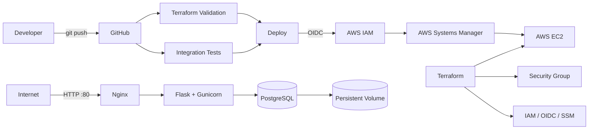

# AWS Docker Web Application

A hands-on DevOps project demonstrating containerization, automated testing, secure AWS deployment, CI/CD, and Infrastructure as Code.

## Architecture



## Tech Stack

| Area | Technologies |
|---|---|
| Cloud | AWS EC2, IAM, Systems Manager |
| Infrastructure as Code | Terraform |
| CI/CD | GitHub Actions, GitHub OIDC |
| Containers | Docker, Docker Compose |
| Reverse Proxy | Nginx |
| Application | Flask, Gunicorn |
| Database | PostgreSQL |
| OS | Ubuntu Linux |

## Project Overview

The application runs as a three-service Docker Compose stack:

- **Nginx** — public reverse proxy
- **Flask + Gunicorn** — application service
- **PostgreSQL** — persistent database

Only Nginx is exposed publicly.

The application and database remain inside Docker's internal network.

## Health Checks

The application provides:

- `/health` — application health
- `/db-health` — PostgreSQL connectivity
- `/visits` — persistent database read/write test

Both the application and PostgreSQL containers include health checks.

## Persistent Storage

PostgreSQL uses a Docker named volume.

Persistence was tested by:

1. Writing data through `/visits`
2. Stopping and recreating all containers
3. Starting the stack again
4. Confirming the stored counter continued instead of resetting

This verifies that database data survives container recreation.

## CI/CD Pipeline

Every push to `main` triggers GitHub Actions.

### Terraform Validation

```bash
terraform fmt -check
terraform init -backend=false
terraform validate
```

### Integration Tests

The pipeline automatically:

- validates Docker Compose
- builds the application
- starts Nginx, Flask, and PostgreSQL
- waits for application health
- checks database connectivity
- performs database write/read tests
- cleans up the test environment

### AWS Deployment

Deployment runs only after validation and integration tests succeed.

```text
GitHub Actions
      |
      v
GitHub OIDC
      |
      v
Temporary AWS credentials
      |
      v
AWS Systems Manager
      |
      v
EC2
      |
      v
Git update
      |
      v
Docker Compose build
      |
      v
Health verification
```

No permanent AWS access keys are stored in GitHub.

No EC2 SSH private key is stored in GitHub.

## AWS Security

### Network Access

| Port | Access |
|---|---|
| 22 / SSH | Trusted administrator IP only |
| 80 / HTTP | Public |
| 5000 / Gunicorn | Private Docker network |
| 5432 / PostgreSQL | Private Docker network |

### EC2 Security

The EC2 instance uses:

- Ubuntu Server
- encrypted `gp3` EBS storage
- IMDSv2
- IAM instance profile
- AWS Systems Manager

### GitHub Authentication

GitHub Actions authenticates to AWS using OIDC.

The AWS IAM trust relationship is restricted to:

- this repository
- the `main` branch

This avoids storing long-lived AWS credentials in GitHub.

## Infrastructure as Code

Terraform manages:

- EC2 instance
- Security Group
- EC2 IAM role
- EC2 instance profile
- SSM managed policy attachment
- GitHub OIDC provider
- GitHub deployment IAM role
- GitHub deployment IAM policy
- IAM policy attachment

The infrastructure was originally created manually and then imported into Terraform.

Terraform was brought to zero drift:

```text
No changes. Your infrastructure matches the configuration.
```

## Terraform Structure

```text
infra/
└── terraform/
    ├── main.tf
    ├── providers.tf
    ├── variables.tf
    ├── outputs.tf
    └── .terraform.lock.hcl
```

Terraform state and local variable files are excluded from Git.

## Terraform Outputs

```bash
terraform output
```

Outputs include:

- EC2 instance ID
- public IP
- public DNS
- Security Group ID
- EC2 SSM role ARN
- GitHub deployment role ARN

> The EC2 public IP can change after a stop/start cycle. Deployment does not depend on the public IP because GitHub Actions uses the EC2 instance ID through AWS Systems Manager.

## Run Locally

Create the environment file:

```bash
cp .env.example .env
```

Start the stack:

```bash
docker compose up -d --build
```

Check services:

```bash
docker compose ps
```

Open:

- Application: `http://localhost`
- Health: `http://localhost/health`
- Database health: `http://localhost/db-health`
- Persistence test: `http://localhost/visits`

## Useful Commands

```bash
docker compose logs app
docker compose logs nginx
docker compose logs db
docker compose down
```

> Do not use `docker compose down -v` unless you intentionally want to delete the PostgreSQL data volume.

## Project Status

- [x] Dockerized application
- [x] Docker Compose orchestration
- [x] Nginx reverse proxy
- [x] PostgreSQL persistent storage
- [x] Application health checks
- [x] AWS EC2 deployment
- [x] Automated integration tests
- [x] GitHub Actions CI/CD
- [x] GitHub OIDC authentication
- [x] AWS Systems Manager deployment
- [x] Terraform Infrastructure as Code
- [x] Terraform validation in CI

## Note

HTTPS is intentionally not configured because this portfolio environment uses a temporary EC2 public address instead of a permanent domain.